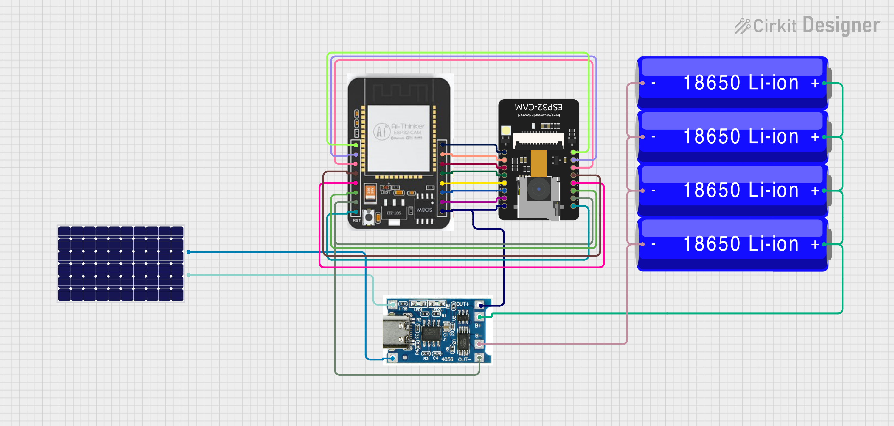

# SentinelNet


An Ethernet-based Security Camera System built with FastAPI and OpenCV + ESP32-CAM

---

## 🚀 Overview

SentinelNet is a lightweight, scalable security camera platform that allows multiple IP camera devices (such as ESP32-CAM) to stream video over an Ethernet or Wi-Fi network. It provides a centralized server for receiving, processing, and viewing camera feeds with optional intelligent motion detection.

---

## 🛠️ Features

- **Multi-Device Support**: Connect and manage multiple cameras simultaneously.
- **Real-Time Video Streaming**: View live feeds via a web interface.
- **Custom Frame Processing**: Analyze incoming video frames with pluggable logic.
- **Easy Device Management**: List and track all connected camera devices.
- **Motion Detection**: Integrate the `MotionDetector` class for smart, event-driven recording.
- **RESTful API**: Well-documented endpoints for easy integration.

---

## ⚡ Quickstart

### Prerequisites

- Python 3.7+
- `pip` (Python package manager)

### Installation

1. **Clone the Repository**
   ```bash
   git clone https://github.com/al-chris/SentinelNet.git
   cd SentinelNet
   ```

2. **Install Dependencies**
   ```bash
   pip install -r requirements.txt
   ```

3. **Run the Server**
   ```bash
   uvicorn app.main:app --host 0.0.0.0 --port 80 --reload
   ```
   The server will be available at [http://localhost:80](http://localhost:80)

---

## 📚 API Usage

### Endpoints

| Endpoint                | Method | Description                           |
|-------------------------|--------|---------------------------------------|
| `/`                     | GET    | Home endpoint (welcome message)       |
| `/upload/{device_id}`   | POST   | Upload a video frame from a camera    |
| `/stream/{device_id}`   | GET    | Stream video from a specific device   |
| `/list_devices`         | GET    | List all connected camera devices     |

### Example: Sending Camera Frames

```python
import requests
import cv2

# Capture frame from camera
cap = cv2.VideoCapture(0)
ret, frame = cap.read()
cap.release()

# Encode frame as JPEG
_, img_encoded = cv2.imencode('.jpg', frame)

device_id = 'camera1'
files = {'file': ('image.jpg', img_encoded.tobytes(), 'image/jpeg')}
response = requests.post(f'http://localhost:8000/upload/{device_id}', files=files)
print(response.json())
```

### Example: Viewing Camera Streams

Paste this in your browser or HTML page:
```html

```

---

### 🗂️ Sequence Diagram


---

## 🔌 Hardware Setup (ESP32-CAM)

Follow these steps to connect your ESP32-CAM device:

### 1. Enable Wi-Fi Hotspot on Your PC

- Open **Settings** > Search for "**hotspot**" > Turn Mobile Hotspot **ON**.
- Note the **SSID** and **password**.

### 2. Find Your Hotspot IP

- Open Command Prompt (`cmd`).
- Run: `ipconfig`
- Find the **IPv4 Address** under "Wireless LAN adapter Local Area Connection*".

### 3. Configure Arduino Sketch

Open `wifi_sketch.ino` in the Arduino IDE and update:

```cpp
const char* ssid =  "your_hotspot_ssid";
const char* password = "your_hotspot_password";
#define SERVER_IP "your_server_ip"
String deviceId = "your_device_id";
```

- Replace placeholders with your actual values.

### 4. Upload to ESP32-CAM

- Connect ESP32-CAM to PC.
- Upload `wifi_sketch.ino`.
- The device should connect to your hotspot and stream to the server.

### 5. Schematic Diagram

<<<<<<< HEAD
Below is a schematic diagram for the hardware connections.  
Make sure to connect the ESP32-CAM board as shown:


=======

>>>>>>> 9515ae535d0f975471eda8da0719408f7dd51d5d

**Tip:** Ensure your firewall allows incoming connections on the server port. Power the ESP32-CAM with a stable supply.

---

## 🎯 Extending with Motion Detection

Integrate the `MotionDetector` class for advanced motion-based recording:

- Automatic background subtraction
- Event-driven recording (only important moments)
- Configurable sensitivity and buffer windows

See `app/motion_detector.py` for usage.

---

## 🗂️ Project Structure

```
SentinelNet/
├── app/
│   ├── __init__.py
│   ├── main.py
│   └── motion_detector.py
├── tests/
├── requirements.txt
├── sketch.ino
├── wifi_sketch.ino
├── LICENSE
└── README.md
```

---

## 📦 Dependencies

- **fastapi** – API framework
- **uvicorn** – ASGI server
- **opencv-python** – Image processing
- **python-multipart** – Multipart form support
- **cryptography** – Secure connections

Install them all with:
```bash
pip install -r requirements.txt
```

---

## 📄 License

MIT License – See [LICENSE](LICENSE) for details.

---

## 🤝 Contributing

Contributions welcome! To submit a feature or bugfix:

1. **Fork** the repo
2. **Create a branch**: `git checkout -b feature/your-feature`
3. **Commit** your changes: `git commit -m 'Add feature'`
4. **Push** your branch: `git push origin feature/your-feature`
5. **Open a Pull Request**

---

## 🌟 Future Enhancements

- User authentication & device authorization
- Web-based motion detection configuration
- Email/SMS alerts on detected events
- Mobile app for remote viewing

---

**Need help?**  
- Check firewall settings if devices can't connect.
- Power and reset ESP32-CAM if not detected.
- For more, open an [Issue](https://github.com/al-chris/SentinelNet/issues).

---
