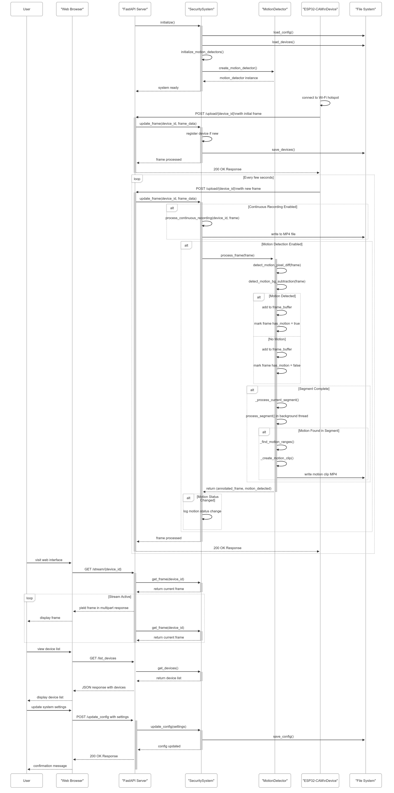
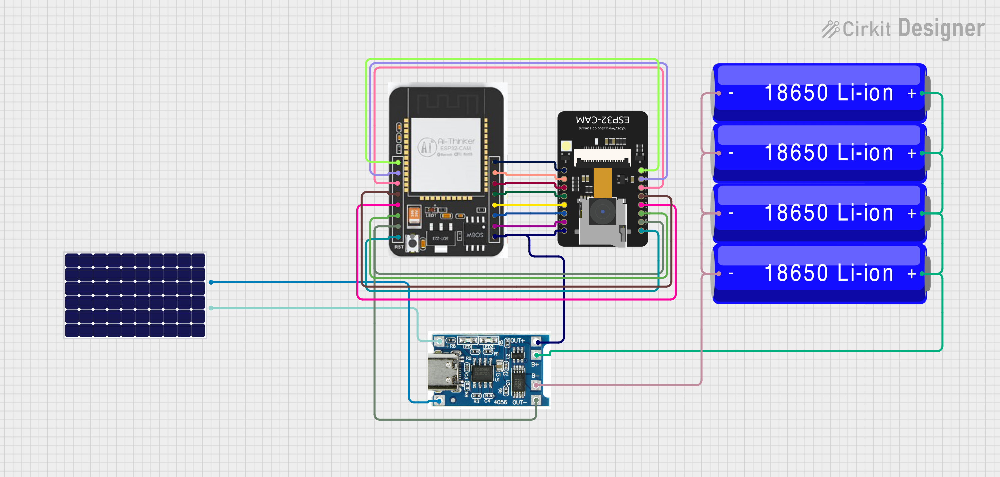

# SentinelNet


An Ethernet-based Security Camera System built with FastAPI and OpenCV + ESP32-CAM

## Overview

SentinelNet is a lightweight, scalable security camera system that enables multiple camera devices to stream video over an Ethernet network. This system provides a centralized platform for receiving, processing, and viewing security camera feeds with intelligent motion detection capabilities.

## Features

- **Multi-Device Support**: Connect and manage multiple IP cameras simultaneously
- **Real-time Video Streaming**: View live camera feeds through a web interface
- **Frame Processing**: Process incoming video frames with custom analysis logic
- **Device Management**: Easily list and track connected camera devices
- **Motion Detection Integration**: Compatible with the `MotionDetector` class to add intelligent motion-based recording
- **RESTful API**: Well-documented API endpoints for integration with other systems

## Installation

### Prerequisites

- Python 3.7+
- pip (Python package installer)

### Setup

1. Clone the repository:
   ```bash
   git clone https://github.com/al-chris/SentinelNet.git
   cd SentinelNet
   ```

2. Install dependencies:
   ```bash
   pip install -r requirements.txt
   ```

3. Run the application:
   ```bash
   uvicorn app.main:app --host 0.0.0.0 --port 8000 --reload
   ```

## API Documentation

### Endpoints

- `GET /`: Home endpoint that returns a welcome message
- `POST /upload/{device_id}`: Upload a video frame from a camera device
- `GET /stream/{device_id}`: Stream video from a specific device
- `GET /list_devices`: List all connected camera devices

### Example Usage

#### Sending Camera Frames

To send a frame from a camera device:

```python
import requests
import cv2

# Capture frame from camera
cap = cv2.VideoCapture(0)
ret, frame = cap.read()
cap.release()

# Encode the frame as JPEG
_, img_encoded = cv2.imencode('.jpg', frame)

# Send to the server
device_id = 'camera1'
files = {'file': ('image.jpg', img_encoded.tobytes(), 'image/jpeg')}
response = requests.post(f'http://localhost:8000/upload/{device_id}', files=files)

print(response.json())
```

#### Viewing Camera Streams

Access the camera stream in a web browser or HTML page:

```html

```

#### Sequence Diagram



## Hardware Setup

Follow these steps to set up the hardware and connect your ESP32-CAM security camera to your PC:

### 1. Set Up a Wi-Fi Hotspot on Your PC

1. Open your computer's **Settings**.
2. Search for "**hotspot**" and navigate to the Mobile Hotspot settings.
3. Turn the hotspot **ON**.  
   *Note: You may need to already be connected to a Wi-Fi network for the hotspot function to work properly.*

4. Note the **SSID** (network name) and **password** for the hotspot—you'll need these in the next step.

### 2. Find Your PC's Hotspot IP Address

1. Open the **Command Prompt** (`cmd`).
2. Type the following command and press Enter:
   ```
   ipconfig
   ```
3. Look for the section labeled as your hotspot network under "Wireless LAN adapter Local Area Connection*".  
   Find the **IPv4 Address**—this will be your server IP.

### 3. Configure the Arduino Sketch (`wifi_sketch.ino`)

1. Open `wifi_sketch.ino` in the Arduino IDE.
2. Locate the lines for the Wi-Fi credentials and server configuration:
   ```cpp
   const char* ssid =  "your_hotspot_ssid"
   const char* password "your_hotspot_password"
   #define SERVER_IP "your_server_ip"
   String deviceId = "your_device_id"
   ```
3. Replace:
   - `your_hotspot_ssid` with your laptop hotspot's SSID  
   - `your_hotspot_password` with your hotspot password  
   - `your_server_ip` with the IPv4 address you found in the previous step  
   - Optionally, change `your_device_id` to a unique name for this device (optional)

### 4. Upload the Sketch to the ESP32-CAM

1. Connect your ESP32-CAM board to your PC.
2. Upload the modified `wifi_sketch.ino` to the board.
3. Once uploaded, the ESP32-CAM should automatically:
   - Connect to your PC's Wi-Fi hotspot
   - Connect to the server using the provided IP address
   - Start operating as part of the SentinelNet system

### 5. Schematic Diagram

Below is a schematic diagram for the hardware connections.  
Make sure to connect the ESP32-CAM board as shown:



**You're all set!**  
Your ESP32-CAM device should now be communicating over your PC's hotspot and streaming to the server.

---
*For troubleshooting, ensure your firewall allows incoming connections to the server port and that your ESP32-CAM is powered properly.*

## Integrating Motion Detection

The system can be extended with motion detection capabilities by integrating the `MotionDetector` class, which provides:

- Background subtraction for accurate motion detection
- Intelligent recording that only captures relevant events
- Configurable motion sensitivity and recording parameters
- Buffer recording before and after motion events

## Project Structure

```
SentinelNet/
├── app/
│   ├── __init__.py
│   ├── main.py
│   └── motion_detector.py
├── tests/
├── requirements.txt
├── sketch.ino
├── wifi_sketch.ino
├── LICENSE
└── README.md
```

## Dependencies

- fastapi - Web framework for building APIs
- uvicorn - ASGI server implementation
- opencv-python - Computer vision library for image processing
- python-multipart - Support for parsing multipart form data
- cryptography - Cryptography library for secure connections

## License

This project is licensed under the MIT License - see the [LICENSE](LICENSE) file for details.

## Contributing

Contributions are welcome! Please feel free to submit a Pull Request.

1. Fork the repository
2. Create your feature branch (`git checkout -b feature/amazing-feature`)
3. Commit your changes (`git commit -m 'Add some amazing feature'`)
4. Push to the branch (`git push origin feature/amazing-feature`)
5. Open a Pull Request

## Future Enhancements

- User authentication and device authorization
<!-- - Video recording and storage management -->
- Motion detection configuration through web interface
- Email/SMS notifications on detected events
- Mobile application for remote monitoring
